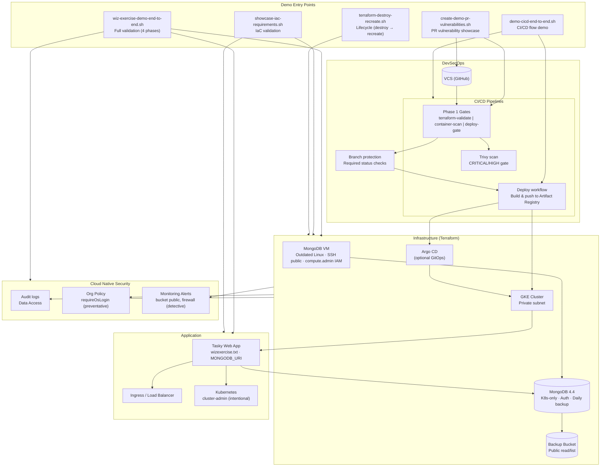
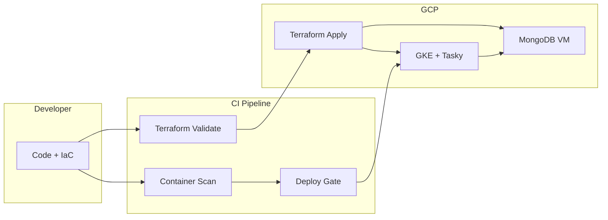
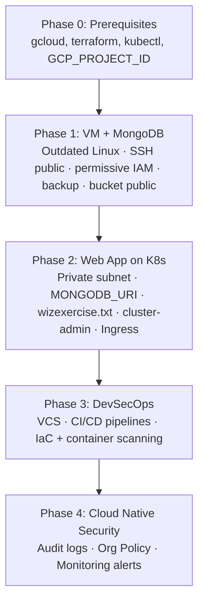

# Demo Architecture – High-Level Mermaid Diagram

## Codebase-accurate high-level diagram

For a **single diagram that matches the actual Terraform, scripts, and workflows** in this repo (entry points, CI/CD, GCP layout, deployment paths), see:

- **[demo-setup-high-level.mmd](demo-setup-high-level.mmd)** – High-level demo setup with Terraform file reference table and deployment modes.

The diagrams below are the original narrative/flow views; the linked file is kept in sync with the codebase.

---

## Rendered Images (for blog posts)

| Diagram | File | Description |
|---------|------|-------------|
| Main architecture | [demo-architecture.png](demo-architecture.png) | Full component overview with demo entry points, DevSecOps, infrastructure, and security |
| Simplified flow | [demo-flow-simple.png](demo-flow-simple.png) | Developer → CI Pipeline → GCP flow |

---

## Simplified Flow (End-to-End)

## Demo Phases (wiz-exercise-demo-end-to-end.sh)

